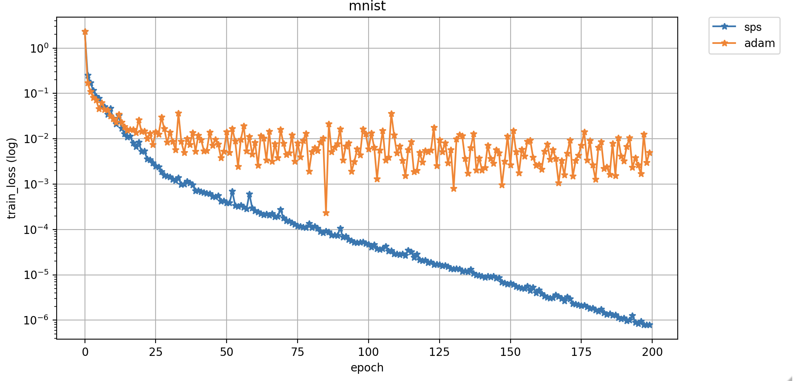

## SPS - Stochastic Polyak Step-size [[paper]](https://arxiv.org/pdf/2002.10542.pdf)

Fast convergence with SPS optimizer. The first efficient stochastic variant of the classical Polyak step-size for SGD

### 1. Install requirements

`pip install -r requirements.txt`
 
This command installs the [Haven library](https://github.com/ElementAI/haven) which helps in managing the experiments.

### 2. Mnist experiment

`python trainval.py -e mnist -sb ../results -r 1`

where `-e` is the experiment group, `-sb` is the result directory.

### 3. kernel experiment

`python trainval.py -e kernel -sb ../results -r 1`


### 4. Visualize

Create the jupyter by running `create_jupyter.py`, and run the first cell to get plots, 




#### Citation

```
@article{loizou2020stochastic,
  title={Stochastic polyak step-size for SGD: An adaptive learning rate for fast convergence},
  author={Loizou, Nicolas and Vaswani, Sharan and Laradji, Issam and Lacoste-Julien, Simon},
  journal={arXiv preprint arXiv:2002.10542},
  year={2020}
}
```

It is a collaborative work between labs at MILA, Element AI, and UBC.
