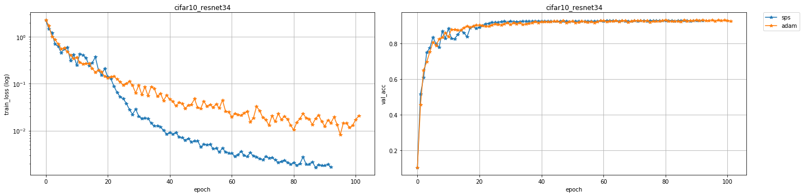

## SPS - Stochastic Polyak Step-size [[paper]](https://arxiv.org/pdf/2002.10542.pdf)

Fast convergence with SPS optimizer. The first efficient stochastic variant of the classical Polyak step-size for SGD


### 1. Install requirements
Install the sps optimizer.

`pip install git+https://github.com/IssamLaradji/sps.git`


Install the [Haven library](https://github.com/ElementAI/haven) for managing the experiments.

`pip install -r requirements.txt`

### 2. Usage
Use `Sps` in your code by adding the following script.

```python
import sps
opt = sps.Sps(model.parameters())

for epoch in range(100):
    opt.zero_grad()
    loss = torch.nn.MSELoss() (model(X), Y)
    loss.backward()

    opt.step(loss=loss)
```

### 3. Experiments

#### 3.1 MNIST

`python trainval.py -e mnist -sb ../results -r 1`

where `-e` is the experiment group, `-sb` is the result directory.

#### 3.2 Kernels

`python trainval.py -e kernel -sb ../results -r 1`


### 4. Results
#### 4.1 Launch Jupyter by running the following on terminal,

```
jupyter nbextension enable --py widgetsnbextension --sys-prefix
jupyter notebook
```

#### 4.2 On a Jupyter cell, run the following script,
```python
from haven import haven_jupyter as hj
from haven import haven_results as hr
from haven import haven_utils as hu

# path to where the experiments got saved
savedir_base = '../results'

# filter exps
filterby_list = [{'dataset':'cifar10', 'opt':{'c':0.2}}, 
                    {'dataset':'cifar10', 'opt':{'name':'adam'}}]

# get experiments
rm = hr.ResultManager(savedir_base=savedir_base, 
                      filterby_list=filterby_list, 
                      verbose=0)
# dashboard variables
legend_list = ['opt.name']
title_list = ['dataset', 'model']
y_metrics = ['train_loss', 'val_acc']

# launch dashboard
hj.get_dashboard(rm, vars(), wide_display=True)
```




#### Citation

```
@article{loizou2020stochastic,
  title={Stochastic polyak step-size for SGD: An adaptive learning rate for fast convergence},
  author={Loizou, Nicolas and Vaswani, Sharan and Laradji, Issam and Lacoste-Julien, Simon},
  journal={arXiv preprint arXiv:2002.10542},
  year={2020}
}
```

It is a collaborative work between labs at MILA, Element AI, and UBC.

#### Credits

- Thank you @lessw2020 for incorporating the gradient centralization method (https://arxiv.org/pdf/2004.01461.pdf), it makes a lot of sense.
